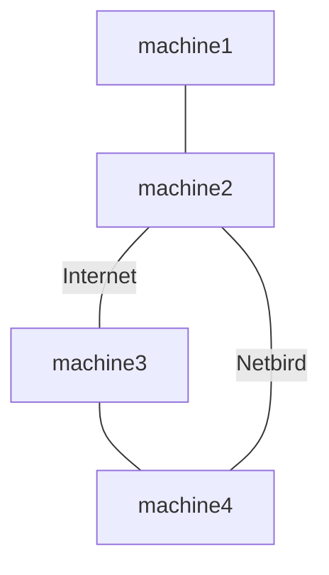

## What is this

It's a test which originally intended to reproduce a bug in netbird where some machines could not get a response from some other machines. The test brings up a netbird cluster inside the `runNixOSTest` environment which looks like this:

In this scenario:

* sending an ICMP echo from `machine1` to `machine4` over the netbird network arrives, but `machine4` does not reply.
* sending an ICMP echo from `machine4` to `machine1` over the netbird network arrives and the reply does also.

> [!IMPORTANT]
> **However, this test cannot reproduce the problem.**

I can only reproduce the problem using netbird.io (hosted). When I switched my real machines to netbird selfhosted, there the problem also went away. This test runs without Internet access (so that it's reproducible) so it cannot access netbird.io.

What I was able to determine is that netbird 0.59.5 works perfectly. In fact, [this is the problematic commit](https://github.com/netbirdio/netbird/commit/3cdb10cde765621086d15e97da150fee884356f6).

## Maybe it's not netbird

* Could it be some external nftables/iptables configuration? Not only have I gone over that with a fine toothed comb, but the symptoms don't correlate: the problem goes away by using netbird selfhosted or by reverting netbird back by one commit.
* Could it be some configuration specific to my netbird.io account? Maybe, but I can't find any meaningful differences in the configuration.

## To run this test

* install nix
* `git clone ...`
* `nix build .#packages.aarch64-darwin.netbird-repro`

Change the netbird version being used by commenting/uncommenting the right line at the top of `packages/netbird-repro/default.nix`

There is a `packages/netbird.nix` package which allows specifying a `netbirdio/netbird` commit. I originally used it with a proper machine to bisect the breaking commit. If needed this package can be plugged into the test with a small bit of work.

## Legal

* GeoLite2 data at `geolite2/*` ([EULA](https://www.maxmind.com/en/geolite2/eula)) from MaxMind