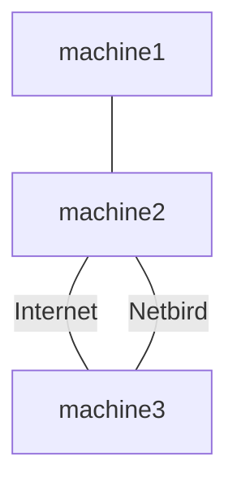

## What is this

This repository reproduces a bug* in netbird where some machines cannot talk to other machines. The test brings up a netbird cluster inside the `runNixOSTest` environment which looks like this:


```mermaid
flowchart TD
    A[machine1] --- B[machine2]
    B ---|Internet| C[machine3]
    B ---|Netbird| C
```

In this scenario:

* ✅ sending an ICMP echo from `machine4` over the netbird network to `machine1` arrives and the reply does also.
* ❌ sending an ICMP echo from `machine1` over the netbird network to `machine4` arrives, but `machine4` does not reply.

\* the netbird team have [documented](https://docs.netbird.io/manage/networks/use-cases/site-to-vpn) that:
  
> The routing peer must perform outbound source NAT for site traffic entering the NetBird overlay.

and reinforced that by linking to this documentation upon seeing the [bug report](https://github.com/netbirdio/netbird/issues/5273).

## Why SNAT/masquerade is undesirable

When the routing peer performs SNAT (masquerade) on all traffic entering the NetBird overlay, the source IP is rewritten to the routing peer's own NetBird address. This makes site-to-VPN connectivity work, but at the cost of hiding the real source IP of every host behind the routing peer.

This is problematic for distributed systems that require bidirectional node identity. For example:

* **Kubernetes** — kubelets and the control plane rely on the source IP of incoming connections to identify which node a request originated from. SNAT makes every node behind a routing peer appear as the same IP, breaking `NodePort`+`externalTrafficPolicy: Local`, kubelet authentication, and cluster health monitoring.

* **GlusterFS** — each brick maintains a peer list by IP address. When a mount client reconnects, the bricks check the source IP against their peer list. If the source has been rewritten by SNAT, the bricks cannot associate the connection with the correct peer, causing mount failures and split-brain conditions.

* **Any clustered protocol that uses mutual authentication by IP** — etcd, Consul, Cassandra, and similar systems all expect to see the originating node's real address in both directions of a connection. SNAT breaks this by making all traffic from behind a routing peer indistinguishable.

The correct fix would allow the NetBird policy engine to accept and forward traffic from non-peer source IPs that belong to advertised network routes, rather than requiring SNAT to disguise them as known peers.

Note: at the time of writing, the `netbird` package can be upgraded to the latest version without breaking this test, the `netbird-management` version is the one which seems to dictate whether this test passes or fails.

## To run this test

* install nix
* `git clone ...`
* `nix build -L .#packages.aarch64-darwin.netbird-repro`
* `nix build -L .#packages.aarch64-darwin.netbird-repro-working`
* `nix build -L .#packages.aarch64-darwin.netbird-repro-broken`
* `nix build -L .#packages.aarch64-darwin.netbird-repro-dev`

`netbird-repro` uses the default `nixpkgs` packages. The `netbird-repro-working` and `netbird-repro-broken` wrappers inject pinned `netbird` and `netbird-management` packages from the corresponding flake inputs.

## Repro targets

`netbird-repro` uses the current default `nixpkgs` packages and follows whichever NetBird version is available there.

`netbird-repro-working` is a control case pinned to a known-working nixpkgs revision. It should pass, and should not be changed while developing a NetBird patch.

`netbird-repro-broken` is a control case pinned to a known-broken nixpkgs revision. It should fail at the repro assertion, and should not be changed while developing a NetBird patch.

`netbird-repro-dev` is the patch development target. It builds NetBird from the local package definitions in this repository and is the only repro target intended for local NetBird source patches.

While iterating on a fix, add local `netbird-management` patches to `netbirdManagementPatches` in `packages/netbird-repro-dev.nix`, then run:

```sh
nix build -L .#packages.aarch64-darwin.netbird-repro-dev
```

## Legal

* GeoLite2 data at `geolite2/*` ([EULA](https://www.maxmind.com/en/geolite2/eula)) from MaxMind
