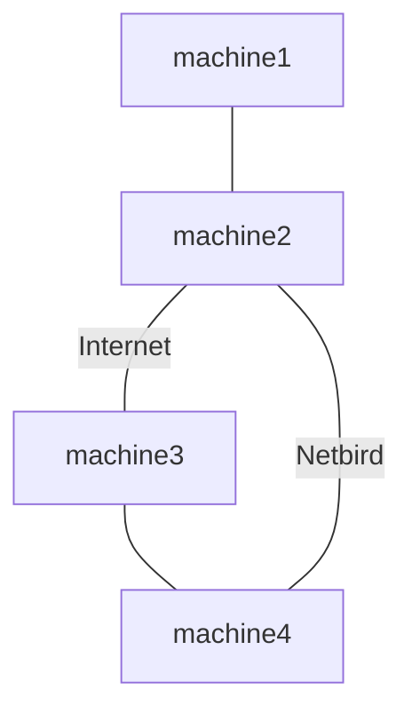

## What is this

This repository reproduces a bug* in netbird where some machines cannot talk to other machines. The test brings up a netbird cluster inside the `runNixOSTest` environment which looks like this:

```mermaid
flowchart TD
    A[machine1] --- B[machine2]
    B ---|Internet| C[machine3]
    C --- D[machine4]
    B ---|Netbird| D
```

In this scenario:

* sending an ICMP echo from `machine1` to `machine4` over the netbird network arrives, but `machine4` does not reply.
* sending an ICMP echo from `machine4` to `machine1` over the netbird network arrives and the reply does also.

\* the netbird team have [documented](https://docs.netbird.io/manage/networks/use-cases/site-to-vpn) that:
 
> The routing peer must perform outbound source NAT for site traffic entering the NetBird overlay.

and reinforced that by linking to this documentation upon seeing the [bug report](https://github.com/netbirdio/netbird/issues/5273).

## To run this test

* install nix
* `git clone ...`
* `nix build -L .#packages.aarch64-darwin.netbird-repro`

Change the netbird version being used by commenting/uncommenting the right line at the top of `packages/netbird-repro/default.nix`

## Legal

* GeoLite2 data at `geolite2/*` ([EULA](https://www.maxmind.com/en/geolite2/eula)) from MaxMind